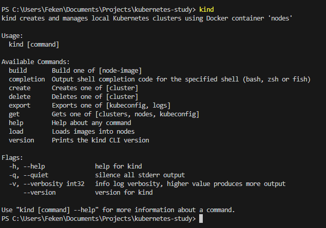
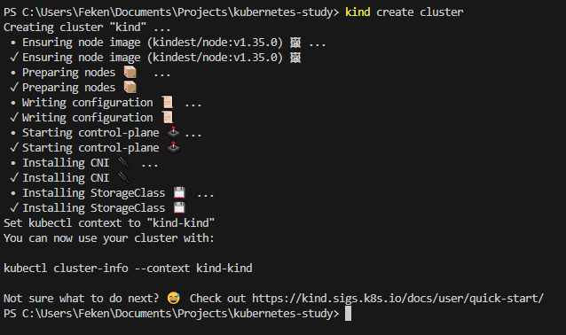
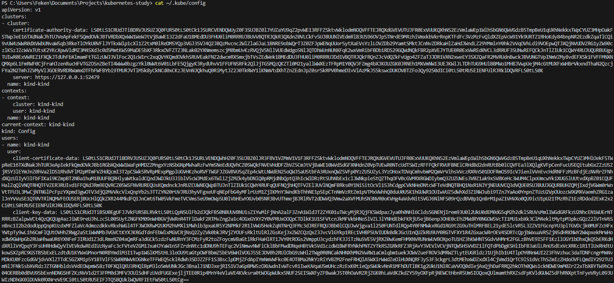
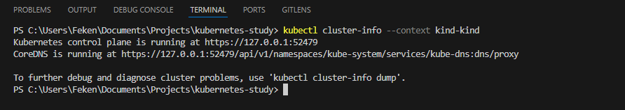
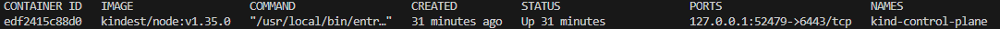
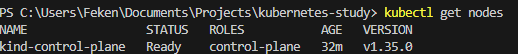

# 🧰 O que é o Kind?

## 📦 Kind (Kubernetes IN Docker)

O **Kind** é uma ferramenta que permite criar clusters Kubernetes locais utilizando containers Docker.

Ele:

- 🏗️ Cria o cluster
- 🐳 Usa containers Docker para simular os Nodes
- 🧪 É ideal para testes e estudos

---

# 🖥️ O que é o kubectl?

## 🔌 kubectl

O **kubectl** é o cliente oficial do Kubernetes.

Ele:

- Se comunica com o cluster através da API
- Permite criar, listar, atualizar e deletar objetos
- É necessário estar instalado na máquina

Importante:

> O kubectl não cria o cluster.  
> Ele apenas gerencia um cluster já existente.

---

# 🚀 Comandos Básicos do Kind

Os comandos mais utilizados são:

```bash
kind create cluster
kind get clusters
kind delete cluster
```

Dica:

Ao digitar apenas:

```bash
kind
```

Você verá todos os comandos disponíveis.

Ex:



---

# 🏗️ Criando o Cluster

Ao executar:

```bash
kind create cluster
```

O Kind:

- Cria um container Docker
- Esse container representa um Node Kubernetes
- Dentro dele roda o Control Plane
- Por padrão, cria um cluster com **apenas um Node**

Ou seja:

Você está rodando um cluster Kubernetes inteiro dentro de um container Docker.



---

# 🔎 Configuração de Contexto (kubeconfig)

Após a criação do cluster, o Kind automaticamente adiciona um novo contexto no arquivo:

```
~/.kube/config
```



Esse arquivo contém:

- 🔐 Credenciais
- 📜 Certificados
- 🌐 Endpoints da API
- 📌 Lista de clusters disponíveis

Ele pode conter múltiplos clusters, por exemplo:

- Um cluster local (Kind)
- Um cluster na AWS
- Um cluster na Azure
- Um cluster na Digital Ocean

---

# 🎯 Selecionando o Contexto

Para visualizar informações do cluster criado pelo Kind:

```bash
kubectl cluster-info --context kind-kind
```

Esse comando:

- Seleciona o contexto do cluster criado pelo Kind
- Mostra onde o Kubernetes está rodando
- Mostra o endereço da API
- Mostra o CoreDNS

Basicamente, você está dizendo ao kubectl:

> "Quero me comunicar com esse cluster específico."



---

# 🧠 Relação entre Kind e kubectl

Fluxo mental:

```
Kind → Cria o cluster
kubectl → Gerencia o cluster
```

O kubectl é apenas um cliente que conversa com o API Server do cluster configurado no contexto atual.

---

# ✅ Verificando se o Cluster Está Rodando

Você pode validar de duas formas:

## 🐳 1️⃣ Verificando via Docker

```bash
docker ps
```

Você verá um container rodando com nome parecido com:

```
kind-control-plane
```

Esse container representa o Node do cluster.



---

## ☸️ 2️⃣ Verificando via kubectl

```bash
kubectl get nodes
```

Esse é o comando mais utilizado.

Ele retorna todos os Nodes do cluster ativo.

Se tudo estiver correto, você verá algo como:



Isso confirma que:

- O cluster está ativo
- O kubectl está conectado corretamente
- O Node está em estado Ready

---

# ✍️ Resumo Mental

```
Kind cria o cluster
kubectl conversa com o cluster
Docker executa o Node
Kubernetes gerencia os Pods
```

Agora você tem um cluster Kubernetes rodando localmente para estudos e experimentação.

---

# 📚 Referências

- [Documentação oficial do Kind](https://kind.sigs.k8s.io/)