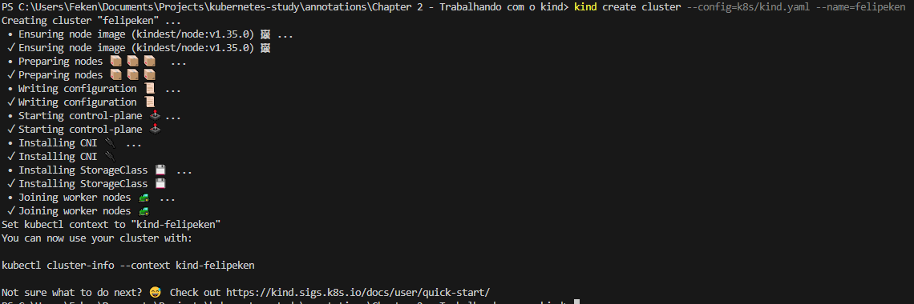
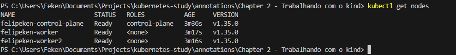

# 🧱 Criando um Cluster Kind com Múltiplos Nodes

Por padrão, o Kind cria um cluster com apenas um único Node (control-plane).

Para simular um ambiente mais próximo de produção, podemos criar um cluster com múltiplos Nodes utilizando um arquivo de configuração YAML.

---

# 📄 Criando o Arquivo kind.yaml

Para definir manualmente a estrutura do cluster, criamos um arquivo chamado `kind.yaml`.

Exemplo:

```yaml
kind: Cluster
apiVersion: kind.x-k8s.io/v1alpha4
nodes:
  - role: control-plane
  - role: worker
  - role: worker
```

---

# 🧠 O que esse YAML está fazendo?

Esse arquivo define como o cluster será criado.

## 🔹 kind: Cluster
Indica que estamos criando um cluster.

## 🔹 apiVersion
Versão da API do Kind utilizada para criar o cluster.

## 🔹 nodes
Lista os Nodes que farão parte do cluster.

Cada item possui um:

### 🎭 role (papel do Node)

- `control-plane` → Responsável pelo gerenciamento do Kubernetes
- `worker` → Responsável por executar Pods

---

# 🏗️ Estrutura Criada

Com esse YAML, teremos:

- 1 Control Plane
- 2 Worker Nodes

Total: 3 Nodes no cluster

Isso permite simular:

- Agendamento real
- Distribuição de Pods
- Testes de alta disponibilidade
- Comportamento do Scheduler

---

# 🚀 Criando o Cluster

Após criar o arquivo, execute:

```bash
kind create cluster --config=k8s/kind.yaml --name=felipeken
```

### 📌 O que esse comando faz?

- `--config` → Define o arquivo YAML personalizado
- `--name` → Define o nome do cluster
- Cria múltiplos containers Docker
- Cada container representa um Node

---

# 🖼️ Resultado Visual da Criação



Como mostrado na imagem:

Agora é possível visualizar múltiplos Nodes sendo criados, diferentemente do cluster padrão com apenas um único Node.

---

# 🎯 Configurando o Contexto

Como o nome do cluster agora é `felipeken`, o contexto gerado será:

```
kind-felipeken
```

Por isso, o Kind solicita que você execute:

```bash
kubectl cluster-info --context kind-felipeken
```

Isso garante que o kubectl esteja apontando para o cluster correto.

---

# 🔎 Verificando os Nodes

Após configurar o contexto, execute:

```bash
kubectl get nodes
```

Você verá algo como:

```
NAME                        STATUS   ROLES           AGE   VERSION
felipeken-control-plane     Ready    control-plane   1m    v1.xx.x
felipeken-worker            Ready    worker          1m    v1.xx.x
felipeken-worker2           Ready    worker          1m    v1.xx.x
```

---

# 🖼️ Visualização do kubectl get nodes



Agora conseguimos enxergar claramente:

- 1 Control Plane
- 2 Worker Nodes
- Todos em estado Ready

---

# 🧠 Diferença para o Cluster Padrão

## Cluster padrão (sem YAML)

- 1 Node apenas
- Control Plane + Worker no mesmo container

## Cluster com kind.yaml

- 1 Control Plane
- Múltiplos Workers
- Ambiente mais realista

---

# 📚 Referências

- [Documentação oficial do Kind](https://kind.sigs.k8s.io/)