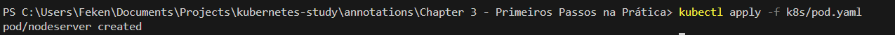
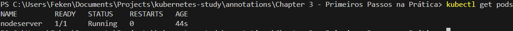

# ☸️ Criando um Pod Manualmente no Kubernetes

Nesta etapa, vamos criar um **Pod manualmente** utilizando um arquivo YAML.

O objetivo é entender como funciona a estrutura básica de um objeto no Kubernetes e como ele é enviado para a API do cluster.

---

# 🌐 Kubernetes é API-Driven

O Kubernetes funciona completamente baseado em API.

Isso significa:

- Tudo que fazemos no cluster é através da API
- `kubectl` é apenas um cliente que conversa com essa API
- Sempre que aplicamos um YAML, estamos enviando uma requisição para o API Server

---

# 📄 Estrutura Básica de um YAML no Kubernetes

Todo arquivo YAML precisa definir:

## 🔹 apiVersion
Define qual versão da API será utilizada.

Exemplo:

```yaml
apiVersion: v1
```

Diferentes tipos de objetos podem utilizar versões diferentes.

---

## 🔹 kind
Define o tipo de objeto que estamos criando.

Exemplos:

- Pod
- Deployment
- Service
- ConfigMap

No nosso caso:

```yaml
kind: Pod
```

---

## 🔹 metadata
Contém informações sobre o objeto:

- Nome
- Labels
- Anotações

Exemplo:

```yaml
metadata:
  name: nodeserver
  labels:
    app: nodeserver
```

---

### 🏷️ Labels

Labels são extremamente importantes.

Elas permitem:

- Filtrar objetos
- Criar regras
- Associar Services
- Organizar aplicações

Exemplo de filtro futuro:

```bash
kubectl get pods -l app=nodeserver
```

Esse comando retorna apenas os Pods com essa label.

---

## 🔹 spec
Define as especificações do objeto.

No caso de um Pod, precisamos definir os containers que irão rodar dentro dele.

Por regra:

```
1 Pod → 1 Container
```

Mas em alguns cenários podemos ter múltiplos containers dentro de um mesmo Pod (ex: sidecar pattern).

---

# 🧱 Exemplo Completo: pod.yaml

```yaml
apiVersion: v1
kind: Pod
metadata:
  name: nodeserver
  labels:
    app: nodeserver
spec:
  containers:
    - name: nodeserver
      image: felipeken/node-k8s:latest
      ports:
        - containerPort: 3000
```

---

# 🧠 O que esse YAML faz?

Ele diz para o Kubernetes:

> "Crie um Pod chamado nodeserver rodando a imagem felipeken/node-k8s:latest"

O Kubernetes então:

1️⃣ Armazena o estado no ETCD  
2️⃣ O Scheduler escolhe um Node  
3️⃣ O kubelet cria o container  
4️⃣ A aplicação começa a rodar  

---

# 🚀 Aplicando o Pod no Cluster

Antes de aplicar, é importante verificar se você está no cluster correto:

```bash
kubectl get nodes
```

Se necessário, altere o contexto, ou se não existir o cluster execute esses comandos como exemplo para criar o cluster e configurar o contexto correto:

```bash
kind create cluster --config=k8s/kind.yaml --name=pods
```

```bash
kubectl cluster-info --context kind-pods
```

---

## 📦 Criando o Pod

Execute:

```bash
kubectl apply -f k8s/pod.yaml
```

Esse comando envia o YAML para a API do Kubernetes.



---

# 🔎 Verificando se o Pod Está Rodando

Para listar os Pods:

```bash
kubectl get pods
```

Se tudo estiver correto, você verá algo como:

```
NAME         READY   STATUS    RESTARTS   AGE
nodeserver   1/1     Running   0          10s
```



---

# 🧠 Fluxo Mental Completo

```
Criar pod.yaml
        ↓
kubectl apply
        ↓
API Server recebe
        ↓
Scheduler escolhe Node
        ↓
kubelet cria container
        ↓
Pod em estado Running
```

---

# ⚠️ Observação Importante

Criar Pods manualmente é útil para estudo.

Em ambientes reais, normalmente utilizamos:

- Deployments
- ReplicaSets
- StatefulSets

Pois eles garantem:

- Escalabilidade
- Alta disponibilidade
- Autocura