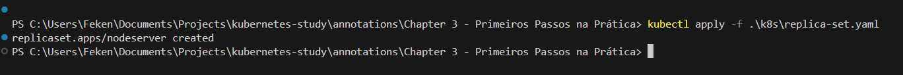
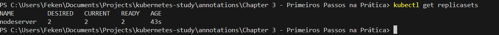
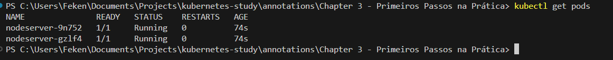
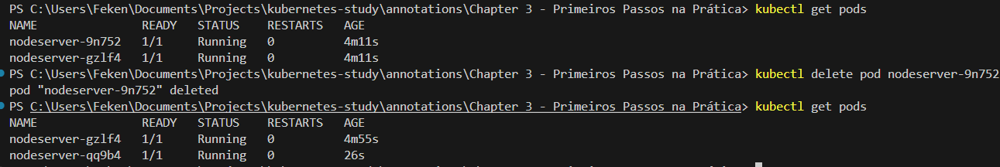

# 🔁 Gerenciando Pods com ReplicaSet

Até agora criamos Pods manualmente.

Para aprendizado isso é excelente.

Mas no dia a dia, em ambientes reais, **não criamos Pods diretamente**.

---

# 🤔 Por que não criar Pods manualmente?

Criar um Pod manualmente não é errado.

O problema é:

- ❌ Se o Pod cair, ele NÃO será recriado automaticamente
- ❌ Não há controle de réplicas
- ❌ Não há garantia de disponibilidade

Em produção, precisamos de:

- Alta disponibilidade
- Escalabilidade
- Autocura

E é aí que entra o **ReplicaSet**.

---

# 📦 O que é um ReplicaSet?

O **ReplicaSet** é um objeto do Kubernetes responsável por:

- Garantir que um número específico de Pods esteja sempre rodando
- Recriar Pods automaticamente caso algum morra
- Permitir escalabilidade horizontal

Ele trabalha comparando:

```
Pods rodando vs Número desejado de réplicas
```

Se houver diferença, ele corrige automaticamente.

---

# 🧱 Exemplo de ReplicaSet

```yaml
apiVersion: apps/v1
kind: ReplicaSet
metadata:
  name: nodeserver
  labels:
    app: nodeserver
spec:
  selector:
    matchLabels:
      app: nodeserver
  replicas: 2
  template:
    metadata:
      labels:
        app: nodeserver
    spec:
      containers:
        - name: nodeserver
          image: felipeken/node-k8s:latest
          ports:
            - containerPort: 3000
```

---

# 🧠 Entendendo a Estrutura

## 🔹 apiVersion

ReplicaSet pertence ao grupo:

```
apps/v1
```

---

## 🔹 selector

```yaml
selector:
  matchLabels:
    app: nodeserver
```

Define quais Pods o ReplicaSet irá gerenciar.

⚠️ Importante:

O selector deve bater exatamente com as labels definidas no template.

---

## 🔹 replicas

```yaml
replicas: 2
```

Define quantos Pods devem estar rodando.

---

## 🔹 template

O `template` é basicamente a definição do Pod que será criado.

É como se fosse um "molde".

O ReplicaSet usa esse template para criar os Pods.

---

# 🚀 Criando o ReplicaSet

Execute:

```bash
kubectl apply -f k8s/replica-set.yaml
```

Isso envia o objeto para a API do Kubernetes.



---

# 🔎 Verificando o ReplicaSet

Para listar os ReplicaSets:

```bash
kubectl get replicasets
```

Você verá algo como:

```
NAME         DESIRED   CURRENT   READY   AGE
nodeserver   2         2         2       30s
```



---

# 🔎 Verificando os Pods Criados

```bash
kubectl get pods
```

Você verá dois Pods rodando com nomes parecidos com:

```
nodeserver-abc123
nodeserver-def456
```



O sufixo é gerado automaticamente.

---

# 🔥 Testando a Autocura

Agora vamos simular uma falha.

Delete um dos Pods:

```bash
kubectl delete pod nome_do_pod
```

O que acontece?

- O Pod é removido
- O ReplicaSet detecta que só há 1 Pod rodando
- Ele cria automaticamente outro
- O total volta para 2

Isso acontece porque ele foi configurado para sempre manter:

```
replicas: 2
```



---

# 🧠 Fluxo Mental do ReplicaSet

```
Definir replicas: 2
        ↓
Criar 2 Pods
        ↓
1 Pod morre
        ↓
ReplicaSet detecta diferença
        ↓
Cria novo Pod automaticamente
```

---

# 📊 Comparação: Pod vs ReplicaSet

| Pod Manual | ReplicaSet |
|------------|------------|
| Não recria se cair | Recria automaticamente |
| Sem escalabilidade | Permite múltiplas réplicas |
| Uso educacional | Uso real em produção |

---

# ⚠️ Observação Importante

Em ambientes reais, normalmente não criamos ReplicaSets diretamente.

Quem cria ReplicaSets automaticamente é o:

```
Deployment
```

O Deployment é um nível acima e gerencia ReplicaSets.

Mas entender ReplicaSet é essencial para entender como o Deployment funciona internamente.