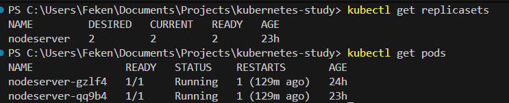
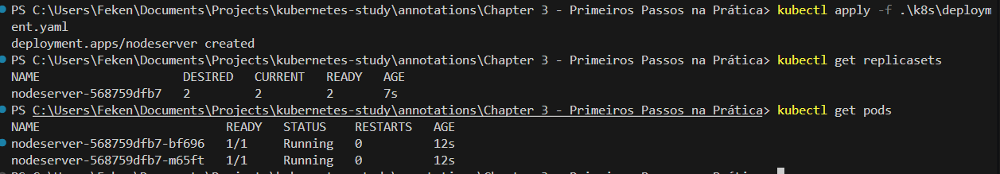

# 🚀 Atualizações Corretas com Deployment

Já entendemos que o ReplicaSet garante:

- Número fixo de Pods
- Autocura
- Escalabilidade

Mas ele não gerencia versionamento de aplicação.

Para resolver isso, utilizamos o objeto:

```
Deployment
```

---

# 🧠 Hierarquia Real

A estrutura correta no Kubernetes é:

```
Deployment
     ↓
ReplicaSet
     ↓
Pods
```

## 📌 Como funciona?

- Quando criamos um **Deployment**
- Ele cria automaticamente um **ReplicaSet**
- O ReplicaSet cria os **Pods**

---

# 🔄 O Que Acontece em um Update?

Se você alterar a versão da imagem dentro do Deployment:

```yaml
image: felipeken/node-k8s:v2
```

O que acontece?

O Deployment:

1️⃣ Detecta que houve mudança no template  
2️⃣ Cria um NOVO ReplicaSet  
3️⃣ Esse novo ReplicaSet cria novos Pods  
4️⃣ Gradualmente substitui os antigos  

Isso se chama:

```
Rolling Update
```

---

# 🧱 Exemplo de Deployment

```yaml
apiVersion: apps/v1
kind: Deployment
metadata:
  name: nodeserver
  labels:
    app: nodeserver
spec:
  selector:
    matchLabels:
      app: nodeserver
  replicas: 2
  template:
    metadata:
      labels:
        app: nodeserver
    spec:
      containers:
        - name: nodeserver
          image: felipeken/node-k8s:latest
          ports:
            - containerPort: 3000
```

---

# 🚀 Criando o Deployment

```bash
kubectl apply -f k8s/deployment.yaml
```

---

# 🔎 Verificando Recursos Criados

## Ver ReplicaSets

```bash
kubectl get replicasets
```

## Ver Pods

```bash
kubectl get pods
```

---

# 🔍 Nome dos Pods

Você perceberá que agora os Pods seguem esse padrão:

```
nome-do-deployment-nome-do-replicaset-sufixo
```

Exemplo:

```
nodeserver-7f8d9c6b7d-abc12
```

Isso mostra a hierarquia:

```
Deployment → ReplicaSet → Pod
```

---

# 🔥 Testando Update de Versão

1️⃣ Altere a imagem no deployment.yaml:

```yaml
image: felipeken/node-k8s:v2
```

2️⃣ Execute:

```bash
kubectl apply -f k8s/deployment.yaml
```

3️⃣ Verifique:

```bash
kubectl get replicasets
```

Você verá:

- Um ReplicaSet antigo (v1)
- Um novo ReplicaSet (v2)

### Infraestrutura antes de utilizar o Deployment:


### Infraestrutura depois de utilizar o Deployment:


---

# 🧠 O Que o Kubernetes Faz Internamente?

O Kubernetes NÃO deleta o ReplicaSet antigo imediatamente.

Ele:

- Mantém o ReplicaSet antigo com 0 réplicas
- Cria um novo ReplicaSet com a nova versão
- Move o tráfego gradualmente
- Mantém histórico para rollback

---

# 🔎 Exemplo Visual

Antes do update:

```
ReplicaSet-v1 → 2 Pods
```

Após update:

```
ReplicaSet-v1 → 0 Pods
ReplicaSet-v2 → 2 Pods
```

O antigo fica guardado.

---

# ⚠️ Observação Muito Importante

O Kubernetes não "atualiza" um ReplicaSet existente.

Ele:

```
Cria um novo ReplicaSet
Reduz o antigo
Escala o novo
```

Isso permite:

- Rolling Update
- Zero downtime
- Rollback fácil

---

# 📊 Comparação Final

| ReplicaSet | Deployment |
|------------|------------|
| Mantém réplicas | Mantém réplicas |
| Autocura | Autocura |
| ❌ Sem versionamento | ✅ Versionamento |
| ❌ Sem rolling update | ✅ Rolling update |
| ❌ Sem rollback | ✅ Rollback |