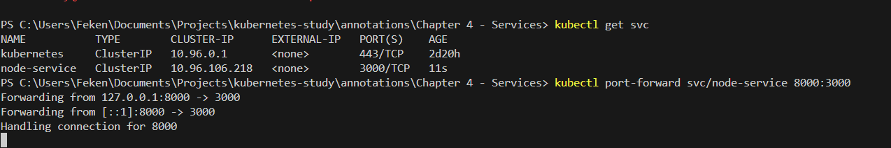
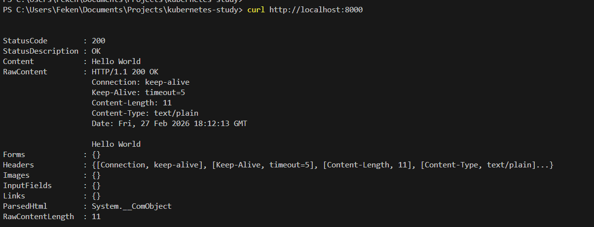

# 🌐 Expondo a Aplicação com Service

Já temos a aplicação rodando.

Mas surge a pergunta:

```
Como acessar essa aplicação?
Em qual Pod ela será acessada?
```

A aplicação estar rodando NÃO significa que conseguimos acessá-la.

Para isso, precisamos de um:

```
Service
```

---

# 🚪 O Que é um Service?

O **Service** é a porta de entrada para os Pods.

Ele:

- Expõe a aplicação
- Atua como Load Balancer interno
- Distribui o tráfego entre os Pods
- Fornece IP estável
- Permite resolução via DNS

---

# ⚖️ Por Que Não Acessar um Pod Diretamente?

Porque:

- Pods possuem IP dinâmico
- Pods podem morrer e serem recriados
- O IP do Pod muda

Se você acessasse diretamente um Pod, perderia o acesso quando ele fosse recriado.

O Service resolve isso criando um ponto fixo de acesso.

---

# 🧱 Exemplo de Service do Tipo ClusterIP

```yaml
apiVersion: v1
kind: Service
metadata:
  name: nodeserver-service
spec:
  selector:
    app: nodeserver
  type: ClusterIP
  ports:
    - name: nodeserver-server
      port: 3000
      targetPort: 3000
      protocol: TCP
```

---

# 🧠 Entendendo o Service

## 🔹 selector

```yaml
selector:
  app: nodeserver
```

Esse selector filtra apenas os Pods que possuem a label:

```
app: nodeserver
```

Aqui entra a importância do `matchLabels` do Deployment.

---

# 📦 Relembrando o Deployment

```yaml
spec:
  selector:
    matchLabels:
      app: nodeserver
  template:
    metadata:
      labels:
        app: nodeserver
```

O Deployment cria Pods com essa label.

O Service usa essa mesma label para saber quais Pods ele deve encaminhar tráfego.

---

# 🎯 Relação Entre Eles

```
Deployment → cria Pods com label app=nodeserver
Service → seleciona Pods com app=nodeserver
```

Essa ligação acontece através das labels.

---

# 🚀 Criando o Service

```bash
kubectl apply -f k8s/service.yaml
```

---

# 🔎 Verificando os Services

```bash
kubectl get svc
```

Exemplo de saída:

```
NAME                  TYPE        CLUSTER-IP      PORT(S)    AGE
nodeserver-service    ClusterIP   10.96.23.145    3000/TCP   1m
```

---

# 🌐 O Que é o CLUSTER-IP?

Esse IP:

- É interno ao cluster
- Só pode ser acessado dentro do Kubernetes
- Representa o Service
- Distribui requisições entre os Pods

Se outro Pod dentro do cluster acessar esse IP, ele será redirecionado para um dos Pods da aplicação.

---

# 🧠 Load Balancing Interno

O Kubernetes automaticamente:

- Balanceia requisições
- Distribui entre os Pods disponíveis
- Remove Pods que estiverem indisponíveis

Isso acontece através do kube-proxy.

---

# 📛 DNS Interno

O Kubernetes também faz resolução via DNS.

Você pode acessar o Service pelo nome:

```
http://nodeserver-service
```

Ou:

```
http://nodeserver-service.default.svc.cluster.local
```

Isso funciona dentro do cluster.

---

# 🚪 Como Acessar o Service Fora do Cluster?

Como estamos usando Kind (cluster local), o Service do tipo ClusterIP não é acessível externamente.

Para acessar fora do cluster, podemos usar:

```
port-forward
```

---

# 🔁 Utilizando Port Forward

Execute:

```bash
kubectl port-forward svc/nodeserver-service 8000:3000
```

Explicação:

```
8000 → Porta da sua máquina
3000 → Porta do Service
```

Agora você pode acessar:

```
http://localhost:8000
```

Ou testar com:

```bash
curl http://localhost:8000
```

E receber:

```
Hello World
```

---

---

# 🔍 Diferença entre `port` e `targetPort`

Essa é uma das partes que mais gera dúvida ao criar um Service.

Vamos esclarecer 👇

```yaml
ports:
  - name: nodeserver-server
    port: 3000
    targetPort: 3000
    protocol: TCP
```

## 🎯 O que é `port`?

- É a **porta do Service**
- É a porta exposta internamente no cluster
- É a porta que outros Pods usam para acessar o Service

Exemplo:

Se outro Pod fizer uma requisição para:

```
http://nodeserver-service:3000
```

Ele está acessando a porta definida em `port`.

---

## 🎯 O que é `targetPort`?

- É a porta onde o container realmente está rodando
- É a porta definida no `containerPort` do Pod

Exemplo no Deployment:

```yaml
containers:
  - name: nodeserver
    image: felipeken/node-k8s:latest
    ports:
      - containerPort: 3000
```

O `targetPort` deve apontar para essa porta.

---

# 🧠 Fluxo de Comunicação

```
Cliente
   ↓
Service (port: 3000)
   ↓
Pod (targetPort: 3000)
   ↓
Container (containerPort: 3000)
```

O Service recebe na `port` e redireciona para o `targetPort`.

---

# 📌 Eles precisam ser iguais?

❌ Não obrigatoriamente.

Você pode fazer algo assim:

```yaml
ports:
  - port: 80
    targetPort: 3000
```

Nesse caso:

- Outros Pods acessam via porta 80
- O container continua rodando na porta 3000

Fluxo:

```
Service:80 → Pod:3000
```

Isso é muito comum quando:

- Você quer padronizar acesso em 80
- Mas sua aplicação roda em outra porta

---

# 🧠 Fluxo Mental Completo

```
Usuário → localhost:8000
        ↓
Port Forward
        ↓
Service (ClusterIP)
        ↓
Load Balancer interno
        ↓
Um dos Pods
```

---

# 📊 Tipos de Service (Resumo)

| Tipo | Uso |
|------|------|
| ClusterIP | Acesso interno (padrão) |
| NodePort | Expõe via porta do Node |
| LoadBalancer | Cria load balancer externo (cloud) |

---

# 🎯 Conclusão

A aplicação rodando dentro de Pods não é suficiente.

Para torná-la acessível, precisamos de:

```
Service
```

O Service:

- Garante IP fixo
- Balanceia tráfego
- Resolve via DNS
- Desacopla cliente de Pods

Sem Service, não existe acesso estável à aplicação.